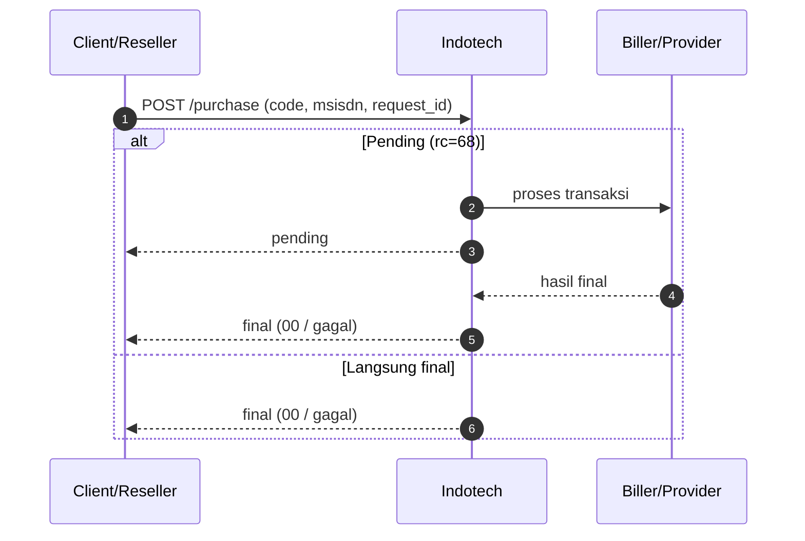
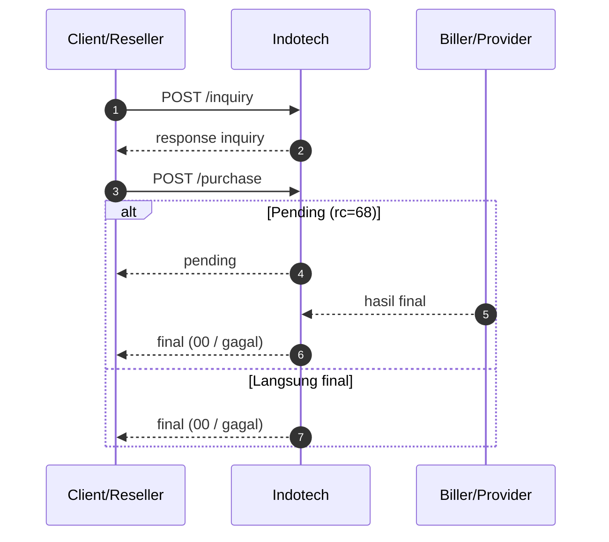

# Introduction & Transaction Flow

Halaman ini menggabungkan **pengenalan singkat** dan **ringkasan alur transaksi**.

## Pengenalan singkat

SOCX menyediakan API reseller untuk transaksi prabayar via koneksi host-to-host.

**Base URL**

```
https://indotechapi.socx.app/reseller/api/v1
```

**Autentikasi**

- Header JSON API: `Authorization: Bearer <JWT>`

**Field transaksi**

- `code`: kode produk (SKU)
- `msisdn`: nomor tujuan / ID tujuan sesuai produk
- `request_id`: ID unik dari sisi client
- `rc`: response code hasil transaksi

## 1) Direct Purchase without inquiry

Dipakai saat produk tidak butuh pre-check.

1. (Opsional) `GET /saldo`
2. `POST /purchase`
3. Cek `rc` di respons
4. Jika `rc=68`, lanjut `POST /status` sampai final



## 2) Payment with inquiry

Dipakai saat produk butuh validasi dulu (contoh: PLN, DANA inquiry).

1. `POST /inquiry`
2. Validasi hasil inquiry (`rc=00`, data pelanggan/produk)
3. `POST /purchase`
4. Jika `rc=68`, lanjut `POST /status`



## Referensi cepat

- Purchase prepaid: [Pembelian Pulsa & Data](transaksi-direct/pembelian-pulsa-data.md)
- Purchase game: [Top Up & Voucher](game/topup-voucher.md)
- Purchase ewallet: [Ewallet Direct Purchase](transaksi-direct/pembelian-ewallet.md)
- Inquiry PLN: [Inquiry PLN](inquiry/inquiry-pln.md)
- Inquiry DANA: [DANA (inquiry)](ewallet/dana-inquiry.md)
