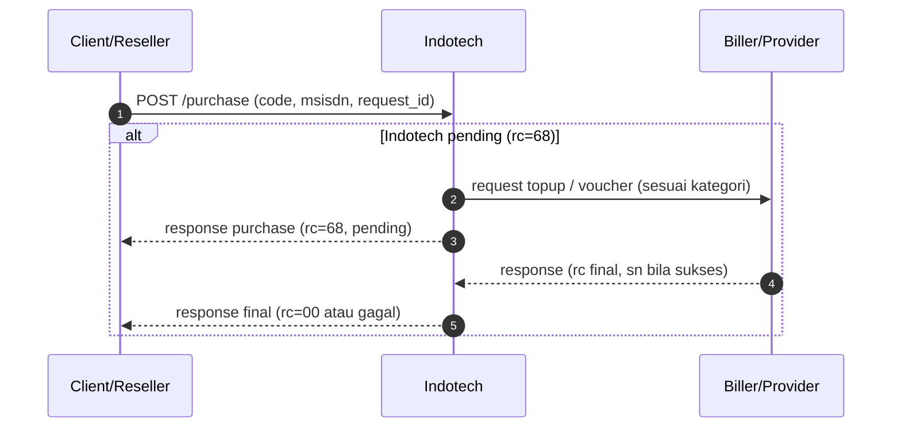

# Klasifikasi produk game

Halaman ini menjadi acuan klasifikasi parameter transaksi per `code`.
Pembagian utama: **Voucher**, **Top-up tanpa zona**, dan **Top-up dengan zona**.

Di API **SOCX purchase**, parameter game biasanya dimapping ke satu field **`msisdn`** sesuai **aturan per `code`** (delimiter dan urutan dari tim SOCX/API).

## Direct Purchase (umum)

Diagram berikut menggambarkan alur sampai transaksi final. Request detail (payload) mengikuti kontrak SOCX/API untuk `code` game Anda. Penjelasan alur terpisah (tanpa inquiry): **[Direct Purchase without Inquiry](flow-direct-purchase-without-inquiry.md)**.

## 1. TOPUP

Detail top-up dipisah ke halaman kategori:

- [Top-up — tanpa zona (non-zone)](../game/topup-non-zone.md)
- [Top-up — dengan zona](../game/topup-zona.md)

| Kategori | Contoh | Arti `msisdn` di purchase | `sn` saat sukses |
|----------|--------|---------------------------|------------------|
| **Top-up — tanpa zona** | FF, AoV, dll. | **User / game ID** (+ parameter lain jika perlu), bukan nomor HP sebagai identitas akun | Biasanya kosong atau referensi; ikuti katalog |
| **Top-up — dengan zona** | ML (Mobile Legends) | **User ID + zone / server ID** dalam format yang disepakati | Biasanya kosong atau referensi; ikuti katalog |

#### Ringkasan topup

- `msisdn` berisi identitas akun game (non-zone) atau gabungan `user_id + zone_id` (zona), sesuai format SKU.
- `sn` pada respons sukses (`rc=00`) umumnya berupa referensi/bukti transaksi (simpan untuk rekonsiliasi).

## Aturan umum field API

| Item | Aturan |
|------|--------|
| `kategori_produk` | `VOUCHER` \| `TOPUP_NON_ZONA` \| `TOPUP_ZONA` (sesuai baris di atas). |
| `msisdn` | Selalu field utama purchase; isinya **bergantung kategori** (HP untuk voucher; ID game / gabungan ID+zona untuk top-up). Untuk top-up zona, klien mengirim nilai gabungan dan SOCX memproses pemisahannya. |
| `request_id` | Wajib unik untuk tiap order baru. |
| `sn` | Untuk **Voucher**: **kode voucher**. Untuk **Top-up**: referensi. |

## 2. VOUCHER

Voucher adalah kategori produk kode digital untuk redeem. Pada kategori ini:

- `msisdn` = nomor HP pelanggan (bukan user ID game)
- `sn` pada respons sukses final (`rc=00`) = kode voucher yang dikirim ke pemain untuk redeem

#### Tabel per code VOUCHER

| code | nama | kategori | format `msisdn` | payload | contoh `msisdn` | `sn` (kode voucher sukses, `rc=00`) | status |
|------|------|----------|-----------------|---------|-----------------|-----------------------------------------|--------|
| `GPC5` | Google Play Rp 5.000 INDONESIA REGION Corporate | `VOUCHER` | nomor HP | `code`, `msisdn`, `request_id` | `081386467468` | `03GCXLDRDPPNBBEL` | Terverifikasi |

Detail request/response dipisah ke halaman:

- Request game: [Pembelian — Game](./pembelian-game.md)
- Respons game: [Respons produk game](./respon-produk-game.md)
- Voucher game: [Voucher Game](../game/voucher.md)

## Panduan pengisian cepat

1. **Tentukan kategori** — Voucher, top-up tanpa zona, atau top-up dengan zona.
2. **Untuk voucher** — pastikan **`msisdn`** = nomor HP; **`sn`** = kode redeem.
3. **Untuk top-up** — susun `user_id` dan `zone_id`/`server_id` jika perlu; mapping ke `msisdn` mengikuti ketentuan SOCX.
4. **Validasi reply** — simpan contoh `rc=00` dan `rc=68` per SKU di halaman response.

## Catatan untuk tim integrasi

- **Voucher** dan **top-up game** adalah **alur bisnis berbeda**; jangan menyamakan `msisdn` voucher (nomor HP) dengan `msisdn` top-up (ID game).
- Jadikan **tabel per `code`** sebagai acuan handover agar tidak salah interpretasi parameter.
