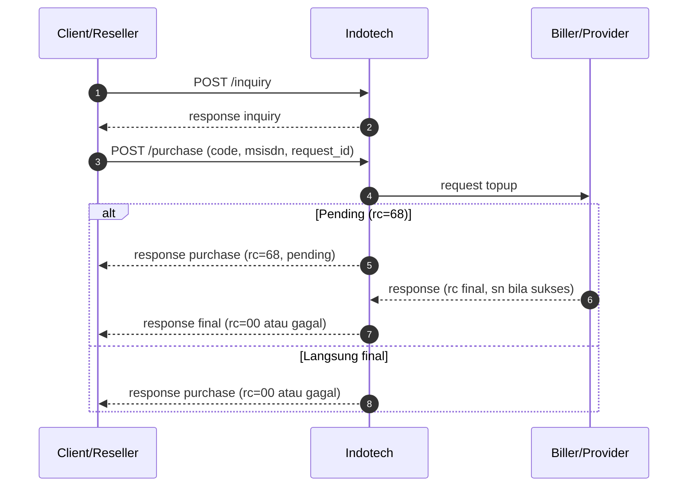
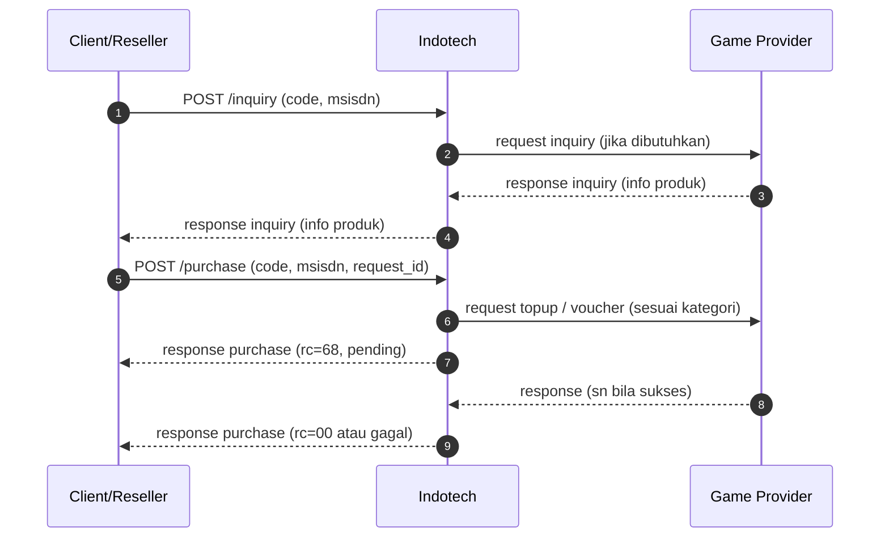

# payment with inquiry

Alur **payment with inquiry** berarti Anda memanggil **`POST /inquiry`** terlebih dahulu untuk **validasi pelanggan / informasi produk**, lalu **`POST /purchase`** dengan parameter yang konsisten (misalnya `code` dan field tujuan dari hasil inquiry). Dipakai ketika SKU atau biller mewajibkan pre-check sebelum debit (contoh: **PLN prabayar**, **DANA** dengan alur inquiry denom, produk lain sesuai katalog).

Request detail (payload) mengikuti kontrak SOCX/API untuk produk Anda.

## Ringkasan langkah integrasi

1. **[`POST /inquiry`](../inquiry/inquiry-post.md)** — kirim `code` dan field yang diminta (mis. `idpel` untuk PLN); pastikan `rc = 00` dan data tampilan (`info[]`) sesuai kebutuhan UI.
2. **[`POST /purchase`](pembelian-json-post.md)** — gunakan `code` yang tepat serta `msisdn` / field setara sesuai kontrak produk (mapping dari inquiry jika perlu).
3. **Baca `rc`** — sama dengan alur tanpa inquiry; lihat [kode respons](kode-respons.md).
4. Jika **`rc = 68`** — [`POST /status`](cek-status.md) atau callback (jika ada).

## Diagram alur (inquiry → purchase)

## Diagram alur game (`code`, `msisdn`)

## Referensi per produk

| Produk / topik | Halaman |
|----------------|---------|
| Kontrak umum inquiry | [Inquiry & katalog](../inquiry/README.md) |
| Contoh `POST /inquiry` (JSON) | [Inquiry POST (JSON)](../inquiry/inquiry-post.md) |
| PLN prabayar | [Inquiry PLN](../inquiry/inquiry-pln.md) |
| DANA (inquiry denom) | [Ringkasan DANA](../ewallet/dana-inquiry.md) |

## Catatan

- Mapping **`idpel` ↔ `msisdn`** atau field lain mengikuti **daftar produk** dari tim API untuk alur inquiry → purchase.
- Jika `request_id` purchase sama dengan transaksi yang sudah ada, perilaku idempotensi mengikuti [pembelian JSON](pembelian-json-post.md).
- Jika respons `rc=68`, transaksi dianggap **pending**.
- Jika request purchase menggunakan `request_id` yang sama, SOCX mengembalikan data transaksi yang sudah ada sesuai data terakhir di sistem.
